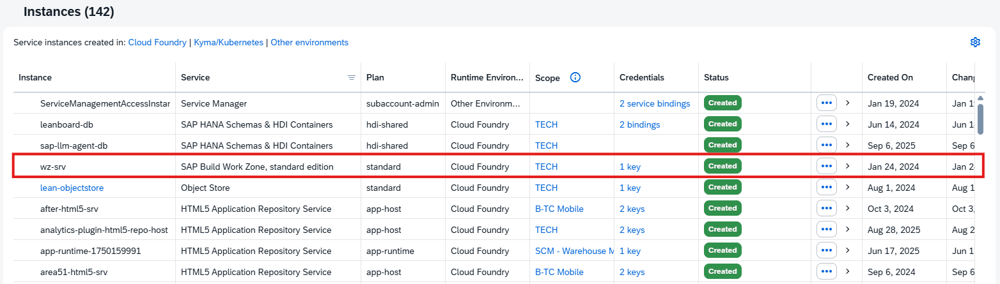

# Getting Started

## Create a destination 
To collect workzone zip file, create a destination.  
You can find client id and secret in the service-key of the service: SAP Build Work Zone, standard edition  

  
Create a destination with the following params
- url : https://b-fdn-dev.dt.launchpad.cfapps.eu20.hana.ondemand.com/cdm_export_service  
- token url : https://b-fdn-dev.authentication.eu20.hana.ondemand.com/oauth/token?grant_type=client_credentials
- username : < clientid found in service-key >
- password : < clientsecret found in service-key >
   

## Frontend 
Find the site ID so that you can choose what page to collect the zip from.  
https://port4004-workspaces-ws-7ga5i.eu20.applicationstudio.cloud.sap/odata/v4/catalog/getWorkzoneData(siteId='testid')  
  
## Run app

- Open a new terminal and run `cds watch`

