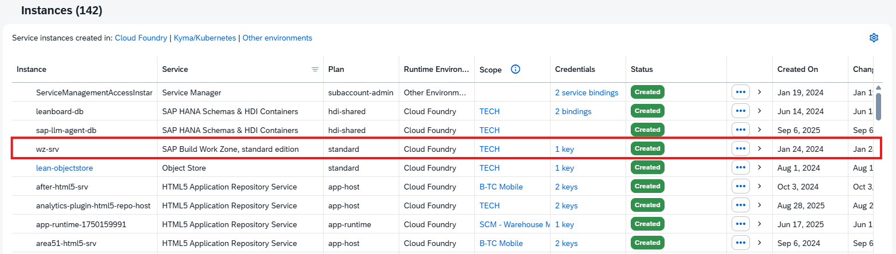
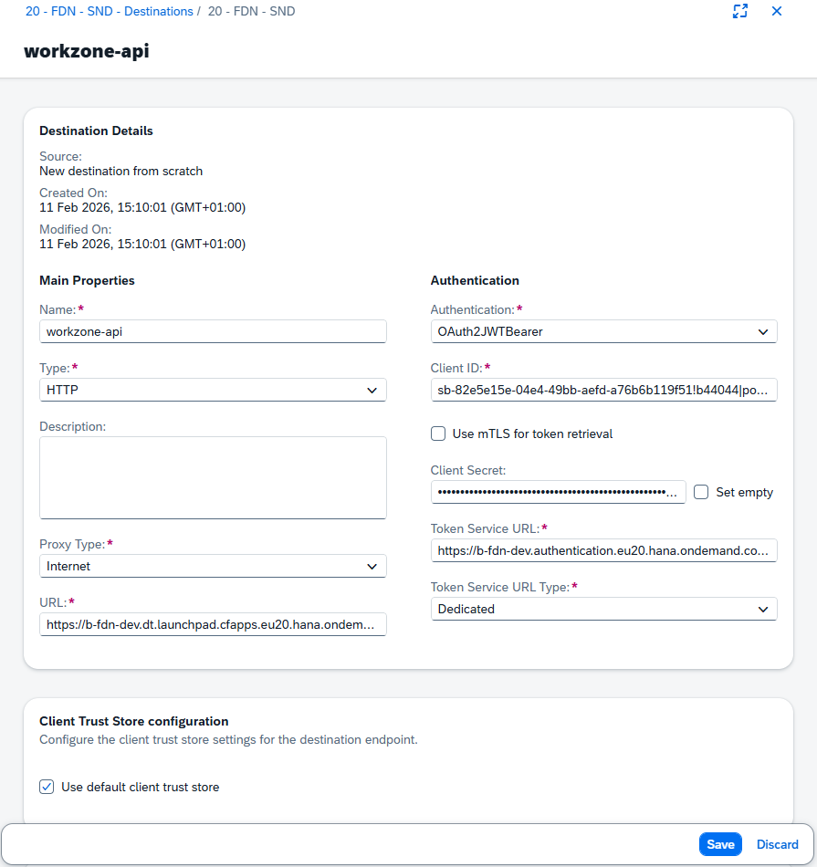

# Getting Started
This app creates an overview for users to monitor what roles have access to spaces, pages and apps. 

## Create a destination 
To collect workzone zip file, create a destination to the [workzone api](https://api.sap.com/api/ContentExport/path/PublicExportController_startExportSite "url to api reference").  
You can find client id and secret in the service-key of the service: SAP Build Work Zone, standard edition  

  
Create a destination with the following params
- name: workzone-api-< subaccount-env > (this can be dev, prd, ... for example workzone-api-dev, workzone-api-prod) 
- url : https://portal-service.cfapps.eu20.hana.ondemand.com 
- Type: HTTP
- Auth: OAuth2JWTBearer
- token url : https://<subaccount_>.authentication.<region_>.hana.ondemand.com/oauth/token?grant_type=client_credentials (in my case: https://b-fdn-dev.authentication.eu20.hana.ondemand.com/oauth/token?grant_type=client_credentials)
- username : <clientid_found_in_service-key>
- password : <clientsecret_found_in_service-key>
   


## Frontend 
The frontend changes to the destination.   
Now DEV, ACC and PRD are in the dropdown.   
If you want others, add it in the frontend and add an extra destination so that it can be reached.
Find the site ID so that you can choose what page to collect the zip from. 
  
## Run app locally

- Open a new terminal and run `cds watch`
- This will take the zip file located in data/ 


## Deployment
``` bash
mbt build  
cf deploy mta_archives/<mta_file.mtar>
```


