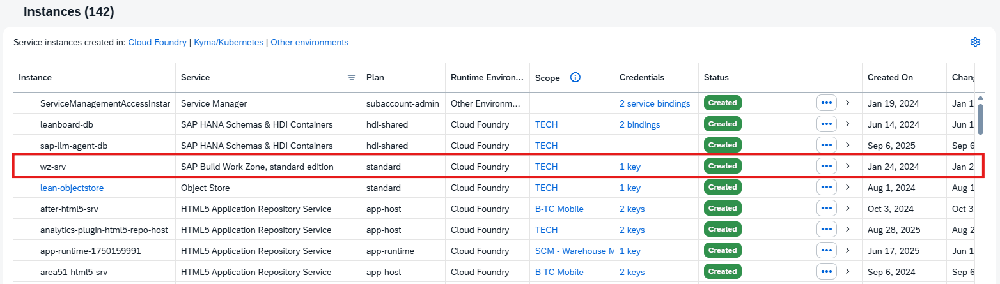
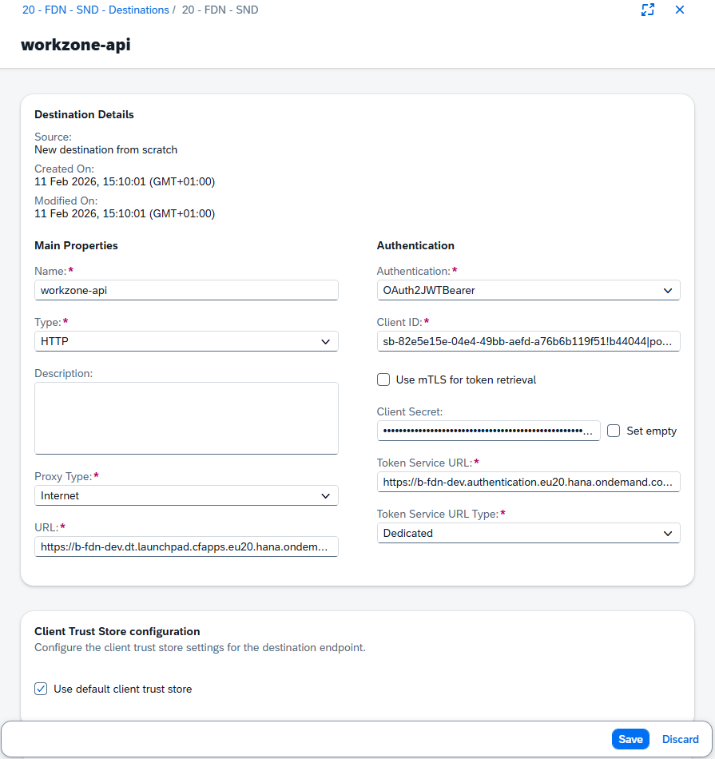

# Getting Started
This app creates an overview for users to monitor what roles have access to spaces, pages and apps. 

## Create a destination 
To collect workzone zip file, create a destination to the [workzone api](https://api.sap.com/api/ContentExport/path/PublicExportController_startExportSite "url to api reference").  
You can find client id and secret in the service-key of the service: SAP Build Work Zone, standard edition  

  
Create a destination with the following params
- name: workzone-api-< subaccount-env > (this can be dev, prd, ... for example workzone-api-dev, workzone-api-prod) 
- url : https://portal-service.cfapps.eu20.hana.ondemand.com 
- Type: HTTP
- Auth: OAuth2JWTBearer
- token url : https://<subaccount.>.authentication.<region.>.hana.ondemand.com/oauth/token?grant_type=client_credentials (in my case: https://b-fdn-dev.authentication.eu20.hana.ondemand.com/oauth/token?grant_type=client_credentials)
- username : <clientid_found_in_service-key>
- password : <clientsecret_found_in_service-key>
   


## Frontend 
The frontend changes to the destination.   
Now DEV, ACC and PRD are in the dropdown.   
If you want others, add it in the frontend and add an extra destination so that it can be reached.
Find the site ID so that you can choose what page to collect the zip from. 
  
## Run app locally

- Open a new terminal and run `cds watch`
- This will take the zip file located in data/ 

## Run app locally against real BTP destinations (hybrid testing)

Test locally with the real destination/connectivity services instead of the local zip file.

1. `cf login` and target the right org/space (`cf target -o <org> -s <space>`).
2. Bind the already-deployed service instances (does **not** create new ones):
   ```bash
   cds bind -a workzone-role-overviewer-srv
   ```
   This writes `.cdsrc-private.json` (git-ignored, no credentials stored — fetched dynamically at runtime).
3. **Known gotcha:** `cds bind -a` sometimes omits `vcap.label` for the `destinations` binding, which makes `@sap-cloud-sdk/connectivity` fail with `Could not find service binding of type 'destination'`. If that happens, open `.cdsrc-private.json` and add `"label": "destination"` next to `"name": "destinations"` in the `destinations` entry.
4. Run:
   ```bash
   cds watch --profile hybrid
   ```
5. The UI itself still uses the bundled zip on `localhost` (see "Run app locally" above) — the environment dropdown / Site ID / Load button only call the real destinations when *not* running on localhost. To actually exercise `getWorkzoneData` (and thus the destinations) while running hybrid, call the OData action directly, e.g.:
   ```bash
   curl "http://localhost:4004/odata/v4/catalog/getWorkzoneData(env='dev',siteId='1af031d9-9029-49a0-9ab5-f880ce5118bb')"
   ```

**Fixed bug (2026-09-08):** the environment `Select` had `selectedKey="workzone-dev"` while its items use keys `dev`/`acc`/`prd`, and the controller's fallback default was `"workzone-dev"` too — neither ever matched a real destination name (`workzone-api-dev`, not `workzone-api-workzone-dev`). Both now default to `"dev"`.


## Deployment
``` bash
mbt build  
cf deploy mta_archives/<mta_file.mtar>
```


## backend apps
Collect the names of the backend apps.  
Read [This blog post](https://community.sap.com/t5/technology-blog-posts-by-sap/sap-build-work-zone-standard-edition-and-joule-health-checks/ba-p/14348321) for the backend endpoints

Backend endpoints: 
- **/sap/bc/ui2/cdm3/entities** 
- **/sap/bc/ui2/cdm3/entities?entityType=role**
- **/sap/bc/ui2/cdm3/entities?entityType=businessapp**
